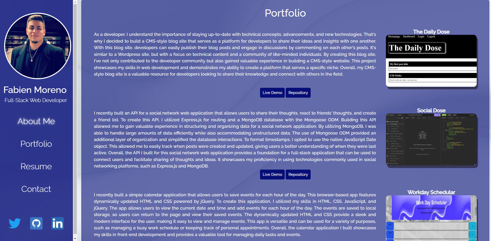
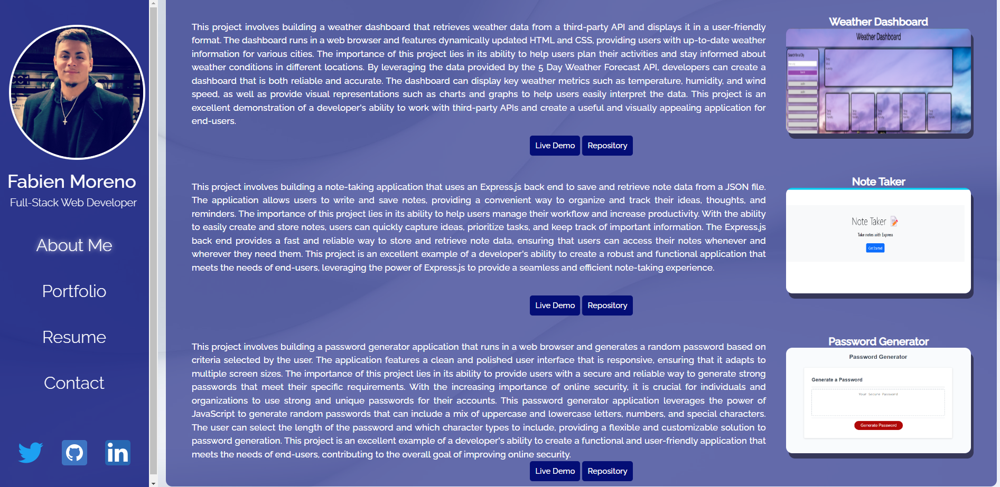
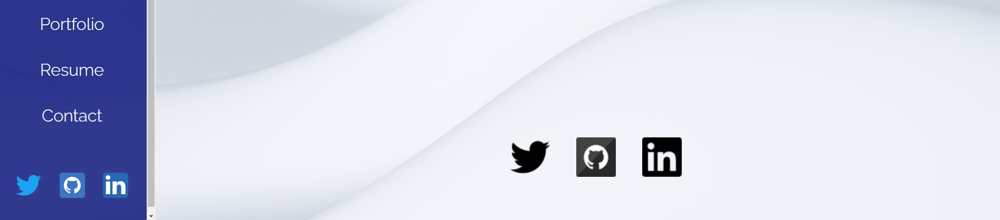

# React-Portfolio

## Description

The purpose of this repository is to showcase current completed work in the course as well as the future content to come. Updates will be made available regularly along with improvements to these projects as I move forward in the course.

## Table of Contents
  - [Installation](#installation)
  - [Usage](#usage)
  - [Technologies](#technologies)
  - [Contributing](#contributing)
  - [Questions](#questions)
  - [License](#license)
  

  ## Installation
  If you're opening this application on your local machine for the first time you will need to type `npm install` in the command line. if you wish to build the server out from your local machine you will need to run the `npm run build` command followed by the `npm run deploy` command.
  

  ## Usage
  Live Demo: https://fabien1313.github.io/react-portfolio/  

  

  

  

  

  
  
  

  
  

  ## Technologies
 - React (https://react.dev/)
 - EmailJS (https://www.emailjs.com/)
 

 ## Contributing
 - GitHub: fabien1313
 

 ## Questions
 If you have questions, comments, or concerns please reach me at https://github.com/fabien1313
 or
 fabienmoreno1331@yahoo.com

 ## License
 **License:** MIT

Copyright (c) 2023 fabien1313

Permission is hereby granted, free of charge, to any person obtaining a copy
of this software and associated documentation files (the "Software"), to deal
in the Software without restriction, including without limitation the rights
to use, copy, modify, merge, publish, distribute, sublicense, and/or sell
copies of the Software, and to permit persons to whom the Software is
furnished to do so, subject to the following conditions:

The above copyright notice and this permission notice shall be included in all
copies or substantial portions of the Software.

THE SOFTWARE IS PROVIDED "AS IS", WITHOUT WARRANTY OF ANY KIND, EXPRESS OR
IMPLIED, INCLUDING BUT NOT LIMITED TO THE WARRANTIES OF MERCHANTABILITY,
FITNESS FOR A PARTICULAR PURPOSE AND NONINFRINGEMENT. IN NO EVENT SHALL THE
AUTHORS OR COPYRIGHT HOLDERS BE LIABLE FOR ANY CLAIM, DAMAGES OR OTHER
LIABILITY, WHETHER IN AN ACTION OF CONTRACT, TORT OR OTHERWISE, ARISING FROM,
OUT OF OR IN CONNECTION WITH THE SOFTWARE OR THE USE OR OTHER DEALINGS IN THE
SOFTWARE.

